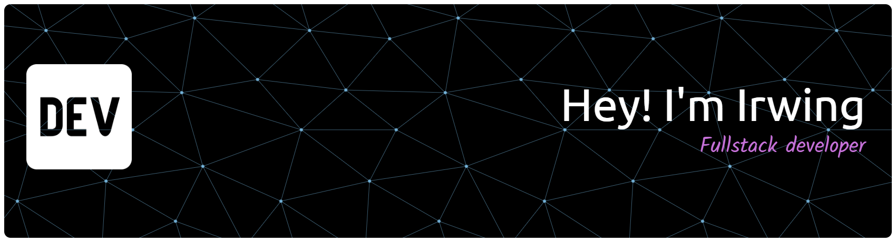

 
<!--

  

 -->

---

## 💫 About Me  
I'm a passionate **Full Stack Developer** who loves building intuitive and efficient digital experiences.  
I work mainly with **Next.js**, **TailwindCSS**, and **Node/Express.js**, but I also explore other stacks to strengthen my skills and understanding of software architecture.  

🚀 One of my proudest achievements was being part of the **SimbioPorto** project — winner of **Challenge 3 of Inova Norte 2025**.
💡 Always curious about automation, artificial intelligence, and how they can improve real-world experiences.

---

## 🧠 Tech Stack  

### 💬 Languages  

### ⚙️ Frameworks & Libraries  

### 🗄️ Databases  

### ☁️ Hosting & DevOps  

### 🎨 Design Tools  

### 🤖 AI & Automation
I'm currently exploring ways to integrate AI and automation into modern web applications.  
My focus includes:
- Building AI-assisted tools using **AI's API** and **Groq**.  
- Automating workflows with **Node.js** scripts and **API integrations**.  
- Experimenting with **chatbots**, **data enrichment**, and **intelligent dashboards**.

---

## 📊 GitHub Stats  

   

